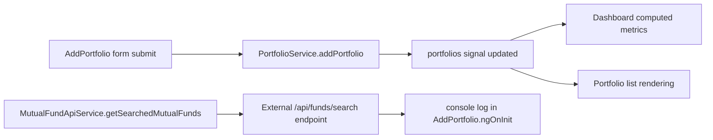

# Architecture Spine — PersonalInvestmentTracker

## Design Paradigm

This application follows a lightweight layered feature architecture centered on Angular standalone components and a singleton state service. The codebase contains a thin app shell, a small set of feature components, a shared core model + service layer, and one external HTTP integration boundary. Business logic is intentionally minimal and is embedded in the service layer rather than modeled as a separate domain or application layer.

The effective dependency direction is:

- App shell depends on feature components
- Feature components depend on service state and UI logic
- Service layer owns in-memory portfolio state and derived calculations
- HTTP integration is isolated behind a dedicated service
- Models are simple value-shape interfaces used by service and components

## Invariants & Rules

### AD-1 — Single-screen shell with a single route
- **Binds:** all app entry behavior; root app shell; routing
- **Prevents:** feature sprawl and route fragmentation in a small app
- **Rule:** The app is configured as a single-route Angular application with the dashboard mounted at the root path. No additional route-level feature boundaries are introduced in the current implementation.

### AD-2 — Service-owned portfolio state
- **Binds:** portfolio data, dashboard metrics, portfolio list display, add/delete actions
- **Prevents:** duplicated state across components and inconsistent portfolio values
- **Rule:** The `PortfolioService` is the authoritative owner of the portfolio collection and derived portfolio calculations. Components read from the service rather than maintaining their own portfolio copies.

### AD-3 — Derived metrics are computed from source state
- **Binds:** dashboard totals, current value, profit/loss, return percentage
- **Prevents:** drift between displayed values and underlying portfolio entries
- **Rule:** `totalInvestment`, `currentValue`, `profitLoss`, and `profitLossPercentage` are computed signals derived from the same `portfolios` signal and must be treated as read-only outputs of the service.

### AD-4 — Feature components render and mutate service-owned state directly
- **Binds:** dashboard, portfolio list, add-portfolio form
- **Prevents:** hidden local state duplication or inconsistent UI state
- **Rule:** Decision-making and mutation happen in feature components via direct calls to `PortfolioService` methods (`addPortfolio`, `removePortfolio`) rather than through a store, reducer, or query layer.

### AD-5 — Model shape is intentionally minimal and domain-light
- **Binds:** `SIP` data model; portfolio records; UI binding
- **Prevents:** over-modeling or mismatched assumptions across features
- **Rule:** The portfolio domain is represented by a single `SIP` interface with a small set of fields (`id`, `schemeCode`, `fundName`, `monthlyAmount`, `startDate`, `category`, `expectedReturns`). No additional domain aggregates or persistent entities are defined in the current code.

### AD-6 — External API access is isolated behind a dedicated service
- **Binds:** mutual fund search integration boundary
- **Prevents:** HTTP knowledge leaking into presentation components or business logic
- **Rule:** `MutualFundApiService` owns the HTTP call and exposes a search method; calling components may trigger it, but they do not perform direct HTTP requests.

### AD-7 — Tests are currently smoke-level and component-scoped
- **Binds:** app shell and feature component verification
- **Prevents:** false confidence from untested behavior or unverified business logic
- **Rule:** Existing tests validate component instantiation and basic app creation only; they do not verify business behavior, service logic, form validation, or API integration.

## Consistency Conventions

| Concern | Convention |
| --- | --- |
| Naming (entities, files, interfaces, events) | Feature names are camel-cased in class names and file names; component selectors use `app-*` naming conventions. |
| Data & formats | Portfolio entries are plain objects, date values are JavaScript `Date` instances, and numeric values are stored in primitive number fields. |
| State & cross-cutting | Signals and computed values are the active state mechanism; mutation is direct through service methods; side effects are logged to console rather than handled through a structured logger or error boundary. |

## Stack

| Name | Version |
| --- | --- |
| Angular | 22.0.8 |
| Angular Router | 22.x |
| Angular Forms | 22.x |
| Angular Signals | 22.x |
| TypeScript | ~6.0.2 |
| RxJS | ~7.8.0 |
| Vitest | ^4.0.8 |
| HttpClient | Angular 22 |

## Structural Seed

```text
PersonalInvestmentTracker/
  src/
    app/
      app.ts
      app.html
      app.routes.ts
      app.config.ts
      features/
        dashboard/
          dashboard.ts
          dashboard.html
          dashboard.spec.ts
        portfolio/
          portfolio.ts
          portfolio.html
          portfolio.spec.ts
        add-portfolio/
          add-portfolio.ts
          add-portfolio.html
          add-portfolio.spec.ts
      core/
        models/
          sip.model.ts
        services/
          portfolio.service.ts
          mutual-fund-api.service.ts
  package.json
  angular.json
  tsconfig.json
```

## System Boundaries

### 1. App shell boundary
- Governs app bootstrap and routing.
- Owned by [app.ts](/Users/etishamathur/PersonalInvestmentTracker/PersonalInvestmentTracker/src/app/app.ts), [app.routes.ts](/Users/etishamathur/PersonalInvestmentTracker/PersonalInvestmentTracker/src/app/app.routes.ts), [app.config.ts](/Users/etishamathur/PersonalInvestmentTracker/PersonalInvestmentTracker/src/app/app.config.ts).
- Responsibility: wire the router and render the root outlet.

### 2. Feature boundary
- Governs UI presentation and direct service interaction.
- Owned by:
  - [dashboard.ts](/Users/etishamathur/PersonalInvestmentTracker/PersonalInvestmentTracker/src/app/features/dashboard/dashboard.ts)
  - [portfolio.ts](/Users/etishamathur/PersonalInvestmentTracker/PersonalInvestmentTracker/src/app/features/portfolio/portfolio.ts)
  - [add-portfolio.ts](/Users/etishamathur/PersonalInvestmentTracker/PersonalInvestmentTracker/src/app/features/add-portfolio/add-portfolio.ts)
- Responsibility: render portfolio data, provide summary metrics, add new entries, and remove entries.

### 3. Core service boundary
- Governs portfolio state and derived analytics.
- Owned by [portfolio.service.ts](/Users/etishamathur/PersonalInvestmentTracker/PersonalInvestmentTracker/src/app/core/services/portfolio.service.ts).
- Responsibility: keep portfolio list in memory, expose read-only copies, compute `totalInvestment`, `currentValue`, `profitLoss`, and `profitLossPercentage`.

### 4. Model boundary
- Governs the domain record shape.
- Owned by [sip.model.ts](/Users/etishamathur/PersonalInvestmentTracker/PersonalInvestmentTracker/src/app/core/models/sip.model.ts).
- Responsibility: define the `SIP` object contract used by the service and feature layer.

### 5. External integration boundary
- Governs HTTP access to mutual-fund search.
- Owned by [mutual-fund-api.service.ts](/Users/etishamathur/PersonalInvestmentTracker/PersonalInvestmentTracker/src/app/core/services/mutual-fund-api.service.ts).
- Responsibility: hide HTTP details from the UI and keep external API access isolated.

## Component / Service Responsibilities

| Component / Service | Responsibility | Depends on |
| --- | --- | --- |
| `App` | Hosts the router outlet and app shell | Router | 
| `Dashboard` | Displays portfolio summary cards and composes portfolio widgets | `PortfolioService` |
| `Portfolio` | Renders portfolio cards and supports delete | `PortfolioService` |
| `AddPortfolio` | Collects SIP input and submits new records | `FormBuilder`, `PortfolioService`, `MutualFundApiService` |
| `PortfolioService` | Owns portfolio state and calculates portfolio metrics | Angular Signals |
| `MutualFundApiService` | Calls external /api/funds/search endpoint | `HttpClient` |
| `SIP` model | Defines portfolio data structure | none |

## State Management Decisions

- The application uses Angular Signals for state representation.
- The `portfolios` signal is the source of truth for the current portfolio list.
- It is exposed as a read-only signal via `this.portfolios.asReadonly()`.
- `PortfolioService` exposes computed signals for derived financial metrics instead of storing separate mutable copies.
- Components perform mutation by invoking service methods rather than independent local state management.
- No persistence, rehydration, or hydration layer exists in the current codebase.

## Data Flow



Observed data behavior:
- New SIP entries are created inside the form component and pushed into the service state.
- Dashboard and portfolio UI consume the same service state.
- Derived financial totals are recalculated whenever the underlying `portfolios` signal changes.
- The external mutual-fund API is called as a side effect during component initialization and only logged, not integrated into state.

## External Integration Boundaries

- External dependencies are limited to Angular framework modules and the mutual-fund HTTP search endpoint.
- The external boundary is isolated in `MutualFundApiService`, which uses a GET request against `/api/funds/search?q=${searchTerm}&page=1&page_size=2`.
- There is no retry strategy, error mapping, typed response model, caching policy, or backend abstraction beyond the raw `HttpClient.get` call.
- External integration is not connected to the core portfolio state in a production-ready way; it is a placeholder/integration hook only.

## Testing Boundaries

Current tests are limited to the following:
- App creation smoke test
- Dashboard instantiation smoke test
- Portfolio instantiation smoke test
- AddPortfolio instantiation smoke test

These tests validate that Angular component classes can be created under TestBed but do not cover:
- service behavior
- computed financial calculations
- form submission logic
- validation rules
- external HTTP interaction
- state mutation correctness

The testing boundary is therefore intentionally shallow and construction-focused.

## Important Constraints and Assumptions

- The app is intentionally small and single-page.
- The core financial calculations are intentionally derived directly from portfolio entries and start dates.
- The current architecture assumes a single in-memory service is sufficient for the application's current scope.
- There is no persistence layer; all data is lost on refresh.
- The mutual-fund API is not yet integrated into the primary portfolio domain flow.
- No explicit domain layer, repository layer, or application service layer exists.
- The app does not yet enforce backend validation or data integrity checks beyond simple UI form usage.
- The architecture is more prototype-oriented than production-scale, as evidenced by the minimal routing, direct service coupling, and basic test suite.

## Deferred

- Persistence and session restoration are intentionally deferred.
- Route expansion beyond the root dashboard is deferred.
- Real backend/domain services and repository boundaries are deferred.
- Robust error handling and typed API contracts are deferred.
- Advanced state management patterns (store, reducer, event-driven architecture) are deferred.
- Deep domain modeling for mutual-fund metadata, portfolio analytics, or user identity is deferred.
